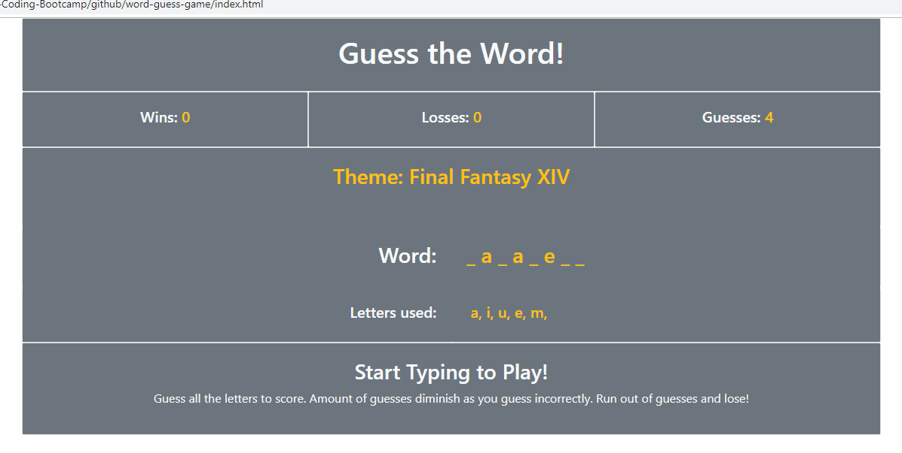

# word-guess-game

# responsive-portfolio

## Summary
A word guessing game based off of Hangman. Written with Javascript to control textContent in HTML elements. Played by typing with your keyboard!

*Rules explained in browser*

### **Functions:**
- Wins counter Increases when all letters are guessed
- Losses counter increases when user runs out of guesses
- Information text is displayed under the theme when necessary
- Ignores non-alphabet key presses
- New word is generated if user scores or loses
- Letters used updates everytime a new alphabet is typed

## Site Picture


## Technologies Used
- HTML
- Bootstrap
- Javascript
- Git
- GitHub
- VSCode

## Links
Live Page: [https://seiretsym.github.io/word-guess-game](https://seiretsym.github.io/word-guess-game)<br>
Repo: [https://github.com/seiretsym/word-guess-game](https://github.com/seiretsym/word-guess-game)<br>
LinkedIn: [https://www.linkedin.com/in/kerwinhy/](https://www.linkedin.com/in/kerwinhy/)<br>
GitHub: [https://github.com/seiretsym](https://github.com/seiretsym)<br>

## Code Snippet
```
// check if key pressed is in the alphabet
function keyAlpha(key) {
    var alpha = ["abcdefghijklmnopqrstuvwxyz"];
    var boolKey = false;

    for (var k = 0; k < alpha[0].length; k++) {
        if (key == alpha[0][k]) {
            boolKey = true;
        }
    }

    // if key pressed is alphabet return true
    if (boolKey) {
        return true;
    }

    else {
        return false;
    }
}

/// playing the game by typing alpha characters
document.onkeyup = function(event) {
    var key = event.key;
    key = key.toLowerCase(); // make sure caps count

    // check if key pressed is in the alphabet -- ignore the rest
    if (keyAlpha(key)) {
        // check if key pressed is a character in the word
        checkWord(key, arrayWord);
    }
    updateLettersUsed(); // refresh letters used textcontent
    checkWin(); // check if user won
}
```